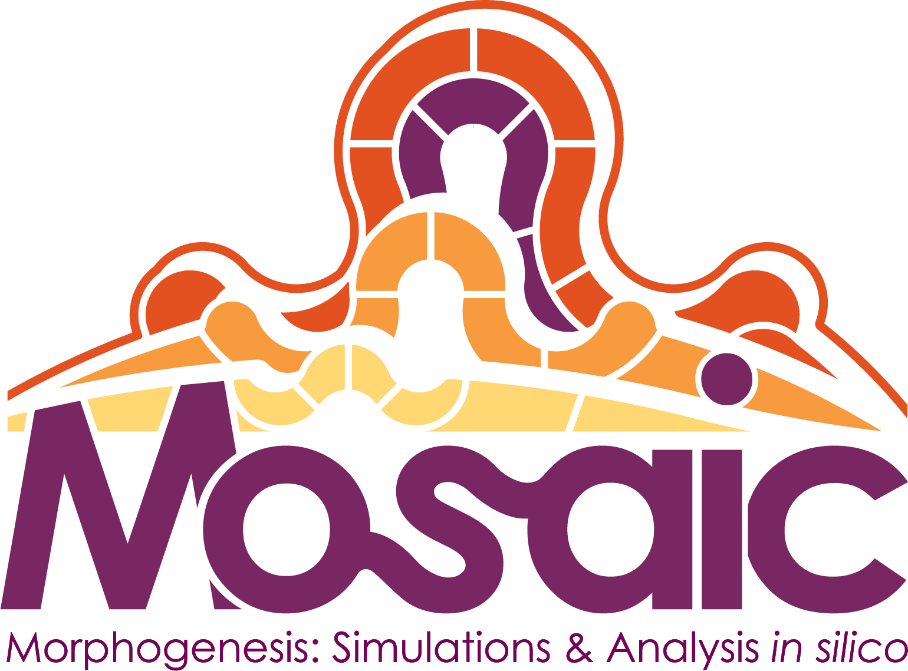
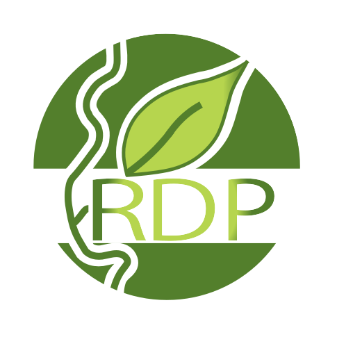

# Credits

% Update "fixed" table of contents on the left quick browse panel
```{eval-rst}
.. toctree::
  :maxdepth: 2
  :hidden:

```

## Funding
This project has received funding from the European Union’s Horizon 2020 research and innovation programme under grant agreement No 773875.


## Involved research teams

<div>
<table style="background-color: #ffffff; margin-top: 2px; margin-bottom: 5px;">

<tbody>
<tr>
<td style="width: 14%; padding: 10px; vertical-align: bottom;"><a href="https://www.inria.fr/equipes/mosaic"></a></td>
<td style="width: 14%; padding: 10px; vertical-align: bottom;"><a href="http://www.ens-lyon.fr/RDP/"></a></td>

</tr>
<tr>
<td style="padding: 10px; font-size: small; vertical-align: top;">The MOSAIC team brings its strong expertise in the area of 3D plant architecture reconstruction and modelling. Notably, the team develops computer pipelines to reconstruct plant architecture from 3D data, to assess their reconstruction, and to segment the architecture in its constituent organs.</td>
<td style="padding: 10px; font-size: small; vertical-align: top;">The RDP team has a deep understanding of the development and evolution of plant reproductive systems. RDP leads the advanced sensing and analysis of crops, and brings its expertise on the developmental dynamics and modelling of plant architecture.</td>
</tr>
</tbody>
</table>
</div>


## ROMI Official Website

This is the _documentation website_ of the ROMI project, to access the _public project presentation_, follow this link: https://romi-project.eu/


## GitHub sources

### DTW
For now these [sources](https://gitlab.inria.fr/cgodin-dev/dtw) are private.


### ROMI
For now these [sources](https://github.com/romi) are private.
